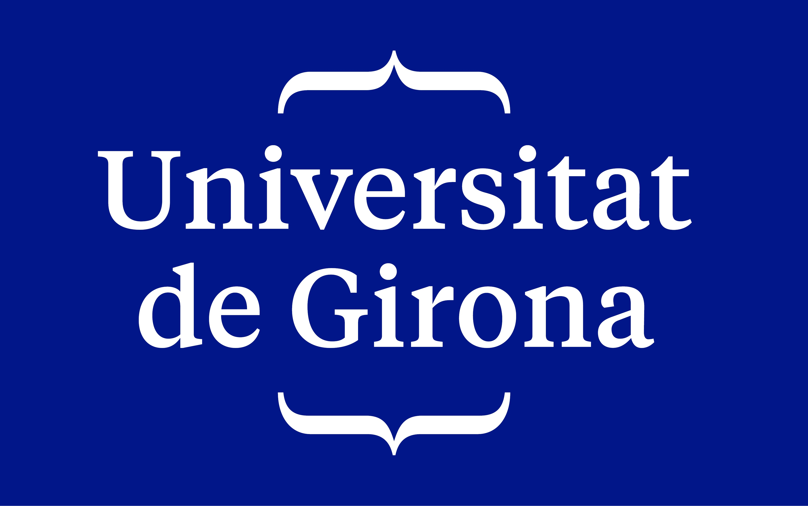

# PYTRON
<div>
   &nbsp; 
  
</div>

## About this project
> Pytron (**PY**thon + elec**TRON**) are a group of scripts that can be used for calculating chemical properties such as Molecular Oxidation States.

### Motivation
This project is part of my final degree project. 
Quantum chemistry is the theory that is behind all the concepts that are being studied during the career, providing a solid basis to ambiguous concepts such as chemical bonding, reactivity or electron transfer reactions.
Through the development of new computational algorithms, the objective of this project is to be able to explain these phenomena by performing computational calculations of these properties through the wave function.

## Quick start
### Setup
```bash
git clone https://github.com/redscorpse/pytron && cd pytron
python3 -m venv venv-quantum
source venv-quantum/bin/activate
pip install -r requirements.txt
```

### Usage
Examples can be found at `./tests`.

By specifying the atomic coordinates of a molecule and defining the fragments into the ones you want to split, the script calculates the corresponding oxidation state for each defined fragment.

## Resources
- [mgimferrer/APOST3D](https://github.com/mgimferrer/APOST3D)
- [jgrebol/ESIpy](https://github.com/jgrebol/ESIpy)
- [pyscf](https://github.com/pyscf/pyscf)

## How to citate
